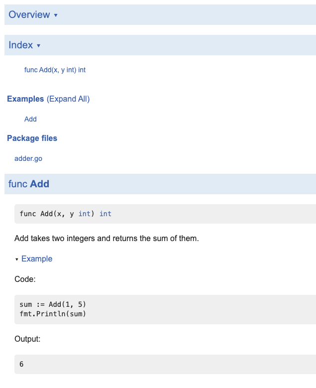

# Note

## Overveiw

[さらに実践的なTDDと整数の処理](https://andmorefine.gitbook.io/learn-go-with-tests/go-fundamentals/integers)

- テスト駆動開発（TDD）ワークフローのさらなる実践
- 整数、加算
- より良いドキュメントを作成して、コードのユーザーがその使用法をすばやく理解できるようにする
- テストの一環としてチェックされるコードの使用例


## Adder を作る

### Test first

まずテストをかく `adder_test.go`

```go
func TestAdder(t *testing.T) {
	sum := Add(2, 2)
	expected := 4

	if sum != expected {
		t.Errorf("expected '%d' but got '%d' ", expected, sum)
	}
}
```

エラーとなる

```bash
$ go test
# github.com/sota0121/lab/notes/learn-go-with-tests/integers [github.com/sota0121/lab/notes/learn-go-with-tests/integers.test]
./adder_test.go:6:9: undefined: Add
FAIL    github.com/sota0121/lab/notes/learn-go-with-tests/integers [build failed]
```

### Minimum Code To Fail

テストを実行するのに必要十分、かつテストに失敗するコードを書く

```go
func Add(x, y int) int {
    return 0
}
```

失敗する

```bash
--- FAIL: TestAdder (0.00s)
    adder_test.go:10: expected '4' but got '0'
FAIL
exit status 1
FAIL    github.com/sota0121/lab/notes/learn-go-with-tests/integers      0.494s
```


### Enough Code to Pass

テストが通る十分なコードを書く

```go
// だとしたらこれでも良いことになっちゃうよ？
// そんなときこそ、Property Based Test (後述) を導入しよう
func Add(x, y int) int {
    return 4
}

// 気を取り直して
func Add(x, y int) int {
    return x + y
}
```

テストが通る

```bash
PASS
ok      github.com/sota0121/lab/notes/learn-go-with-tests/integers      0.495s
```

### Refactor

関数にコメントをつけると、Documentにも反映される。

```go
// Add takes two integers and returns the sum of them.
func Add(x, y int) int {
    return x + y
}
```

## Example 機能を利用する

ref : [Testable Example in Go](https://go.dev/blog/examples)

Goでは実際に挙動をテストできるExample機能がある。テストスクリプトに記述する。

```go
// adder_test.go

func ExampleAdd() {
    sum := Add(1, 5)
    fmt.Println(sum)
    // Output: 6
    // ↑↑ このコメントがないとコンパイルしかされない。テスト時に実行されない。
}
```

doc 上ではこんな感じで表示される。



