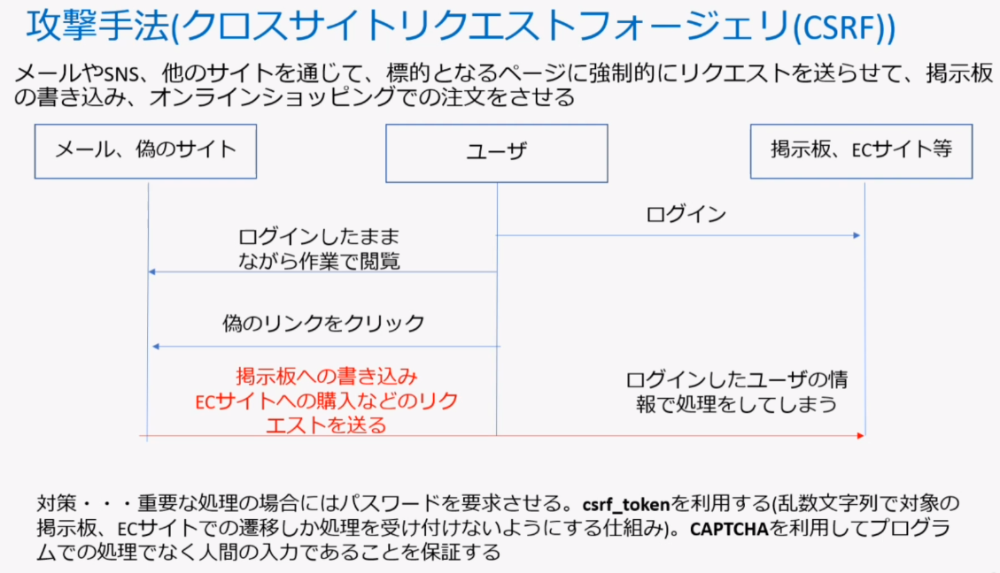
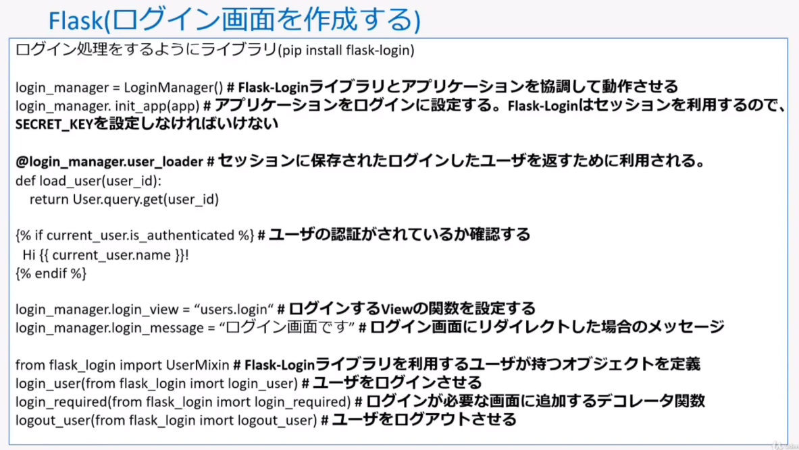

# Note

- [Note](#note)
  - [repo](#repo)
  - [1. Flask Basics Overview](#1-flask-basics-overview)
  - [2. Jinja2 / Template](#2-jinja2--template)
  - [3. Error Handling](#3-error-handling)
  - [4. Form](#4-form)
  - [5. wtforms](#5-wtforms)
  - [6. Form(wtforms) / Macro on Template / session](#6-formwtforms--macro-on-template--session)
  - [7. wtforms - Field](#7-wtforms---field)
  - [8. wtforms - validation](#8-wtforms---validation)
  - [9. Model Basics](#9-model-basics)
  - [10. SQLAlchemy Basics](#10-sqlalchemy-basics)
  - [11. ex. Form / Model Integration](#11-ex-form--model-integration)
  - [12. For Practical Application - BluePrint](#12-for-practical-application---blueprint)
  - [13. For Practical Application - login](#13-for-practical-application---login)
  - [14. For Practical Application - AJAX](#14-for-practical-application---ajax)

## repo

- Text: [github - NM-Udemy/FlaskCourse](https://github.com/NM-Udemy/FlaskCourse)
- my repo: [github - sota0121/lab](https://github.com/sota0121/lab)


## 1. Flask Basics Overview

- MVT構成である


- 静的ルーティング
  - 変数がないURL
- 動的ルーティング
  - 変数があるURL
- ルーティングは一つの関数に複数URLを指定することができる

```python
@app.route('/')
@app.route('/hello')
def info():
    return "hello"
```

- debug 方法。`debug=True` でAppを実行すると、エラー時にブラウザでエラー画面になる。実は、これには続きがある。エラー画面でエラー発生行にある「ターミナルアイコン」を押すと、コンソールを開くことができる。
  - その際、PINを入力する必要がある。PINはコンソールに `Debugger pin code` という形で表示されているのでコピペする。
  - 
  - 
- デフォルトは `app.py` 階層の `templates/*.html` を読む
  - 指定する場合は、 `Flask(__name__, template_folder="xxx")` といった形でキーワード引数で指定する


## 2. Jinja2 / Template

- 変数を使う
  - サーバー側では `return render_template('index.html', user={'name': 'taro', 'age': 19})` といった形
  - HTML側は `{{ user.name }}` や `{{ user['name'] }}` といった形で使う。
- 制御文を使う
  - `` / ``
  - `` / ``
- テンプレートの継承
  - 継承元
    - `` / `` で囲んだ場所が継承先で定義する場所
  - 継承先
    - `` がImport文のようなもの。継承する。
    - `` / `` で囲んだ場所に具象を定義する。
  - 継承先のテンプレートで継承元の値を使いたい場合は、 `{{ super() }}` と記述する
- テンプレートのフィルタ
  - どんなものか？<br>
  - templates 上で値を変換するのに使う
  - Document: https://jinja.palletsprojects.com/en/3.0.x/templates/#list-of-builtin-filters
  - パイプのように書くスタイルとブロックで囲むスタイルがある。
  - e.g.
    - capitalize: 先頭を大文字に
    - upper , lower
    - default(): 指定オブジェクトが空の場合に表示する文字列を指定
    - urlize(target=''): ハイパーリンク設定
    - format(): python string の format と同じ
      - `{{"%s(%s)"|format(user['name'], user['age'])}}`
    - first/last: 指定したオブジェクト(list) の先頭、末尾要素を取得
      - `{{users|first}}`
    - sort: 指定したオブジェクト(list)をソートする
      - `{{users|sort|last}}`
    - random
      - `{{users|random}}`
    - reverse
      - `{{users|reverse}}`
    - replace
      - `{{user|replace('taro', 'jiro')}}`
- テンプレートのカスタムフィルタ
  - サーバー側でフィルタを定義。ノリはルーティングと同じ。
  - `@app.template_filter('my_filter')` デコレータをつけてやる。引数は文字列1つ。返り値も文字列。
  - テンプレートファイル内で、ビルトインと同様に呼び出せる。
- コメントアウト
  - `{#}` を先頭に置く、または `{# / #}` で囲む。


## 3. Error Handling

- Flaskの画面遷移とエラーハンドラー
  - `url_for`: 指定したendpoint(関数名)でURLを作成して、返す
    - e.g.: `<a href="{{url_for('func') }}>New Page</a>`
    - e.g.: ``
  - `errorhandler`: デコレーとした関数をエラー発生時に呼び出すように登録する
    - `abort` と組み合わせて使う。
  - `abort`: 指定した status でHTTPExeptionを発生させる
  - `redirect`: 別のURLにクライアントをリダイレクトさせる

```python
@app.errorhandler(404)
def page_not_found(error):
    error_desc = error.desctiption
    print(error_desc)
    return render_template('not_found.html'), 404
# ...

@app.route('/user/<string:user_name>')
def user(user_name: str):
    if user_name in ['taro', 'jiro', 'goro']:
        return redirect(url_for('home', user_name=user_name))
    else:
        abort(404, 'You cannot redirect to the page.')
        # error.desctiption で文字列を取得できる。

```


## 4. Form

- Flask の Form
  - ログイン画面やデータ入力で使われるもの
  - ファイルアップロードなど
  - セキュリティ対策、バリデーションを簡易的に行える wtforms というものがある
  - ModelからDBに安全にデータを入れるためにFormをよく理解する必要がある。


- HTMLの基礎 - form
  - こんな感じ（[GitHubリンク](https://github.com/NM-Udemy/FlaskCourse/blob/main/04_form/templates/signup.html)）<br>
  - form tag とは？
    - form で囲んだ部分に `input` タグを複数置くことができ、この `input` の情報をサーバーに送付するのが、 `form` タグの役割と思われる
    - 送付するときは、GETならURLで、POSTならBodyで送る。
  - `label` タグは、指定した `input/select/...` など入力系タグに表示用の名前を設定するものと思われる。 `<label for="NAME">` `<input type="text" name="NAME">` といった形で、 `name` 属性にしていした名前を指定することで、任意の入力タグにラベルをはる。ラベルは入力要素の左側にくる？（これはよくわからん）
  - `<input type="submit" value="disp-name">` が送信ボタンである。
- Formによる画像のアップロード
  - 
- `pykakashi` により日本語をアスキー文字に変換できる（あああ→aaa）。これを使えば、 `werkzeug.scure_filename()` 実行前に日本語を英語に変換すれば、なんでも対処できる。 **日本語ファイル名によるバグが起こるので、これはほぼ必須の対応** と思われる。

```python
import pykakasi

class Kakashi

    kakashi = pykakasi.kakasi()
    kakashi.setMode('H', 'a') # hiragana -> ascii
    kakashi.setMode('K', 'a') # katakana -> ascii
    kakashi.setMode('J', 'a') # kanji -> ascii
    conv = kakashi.getConverter()

    @classmethod
    def ja_to_ascii(cls, japanese: str) -> str:
        return cls.conv.do(japanese)

# --- e.g. ---
filename = file.filename
filename_ascii = Kakashi.ja_to_ascii(filename)
save_filename = secure_filename(filename_ascii)
file.save(os.path.join('./static/image', save_filename))
```

- ファイルアップロードするときの form
  - `<form action="{{url_for('upload')}}" method="POST" enctype="multipart/form-data">XXXX</form>`


## 5. wtforms

- wtformとは？
  - 
- wtform では、Formのクラスをサーバー側に定義して、Formで送信された情報の精査＋オブジェクト化を行うようだ。
- CSRF攻撃とは？
  - Cross Site Request Forgery
  - ref: [クロスサイトリクエストフォージェリ - Trend Micro](https://www.trendmicro.com/ja_jp/security-intelligence/research-reports/threat-solution/csrf.html)
  - 
  - 
  - 要は、外部サイトからのForm入力を受け付けてしまうことによる問題
- wtform -> `pip install wtforms`
- app.config['SECRET_KEY'] には乱数を設定する。（ `os.urandom(16)` が公式推奨方法 ）
- Formクラスを作る

```python
from flask import (Flask, render_template, request)
from wtforms import (StringField, SubmitField, IntegerField)
from wtforms.form import Form

# ...

class UserForm(Form):
    name = StringField('名前')
    age = IntegerField('年齢')
    submit = SubmitField('Submit')

@app.route('/', methods=['GET', 'POST'])
def index():
    name = age = ''
    form = UserForm(request.form)
    if request.method == 'POST':
        if form.validate(): # check value type ... etc
            name = form.name.data
            age = form.age.data
            form = UserForm() # create empty form
        else:
            print('invalid form')
    return render_template('index.html', form=form, name=name, age=age)

```

```jinja2


<p>
    
    名前: {{ name }} <br>
    年齢: {{ age }}
    
    名前と年齢を入力してください。
    
</p>

<form method="POST">
    {{ form.csrf_token }}
    <!-- label/input タグに相当する情報を定義↓↓ -->
    {{ form.name.label }}{{ form.name() }}
    {{ form.age.label }}{{ form.age() }}
    {{ form.submit() }}
</form>

```


## 6. Form(wtforms) / Macro on Template / session

- 
- template 内で関数を定義し、使いまわすことができる。（当然できるとは思っていたが、やり方を知りたかった）
  - 関数定義: ` / ` (仮に `_form.html` で定義しているとする)
  - 関数読み込み: ``
- sessionは `flask.session` というライブラリを使う。
- `render_field(field)` マクロでFormの各フィールドのバリデーションや表示を制御する関数を定義。これを使いまわす。
- [html - dd/dt/dl 要素](https://ferret-plus.com/5063)
  - `<dt>`: definition term
  - `<dd>`: definition description
  - `<dl>`: definition list

```jinja2
<!-- _formhelpers.html -->

<dt>{{ field.label }}</dt>
<dd>{{ field(**kwargs)|safe }}</dd>


<ul class="error">
    
    <li>{{ error }}</li>
    
</ul>


```

```jinja2
<!-- register.html -->




<form method="POST">
    {{ form.csrf_token}}
    {{ render_field(form.name) }}
    {{ render_field(form.age) }}
    {{ render_field(form.password) }}
    {{ form.submit() }}
</form>


```

- sessionを設定
  - `form = UserForm(request.form)` and `form.validate()`
  - `session['name'] = form.name.data`

```python
from flask import session # ...
from wtforms.form import Form # ...

# app = Flask(__name__)
# ...
# class UserForm(Form)
# ...

@app.route('/')
def index():
    form = UserForm(request.form)
    if request.method == 'POST' and form.validate():
        session['name'] = form.name.data
        session['age'] = form.age.data
        return redirecto(url_for('show_user'))

    return render_template('register.html', form=form)

@app.route('/show_user')
def show_user():
    return render_template('show_user.html')
```

- `session` に値を設定した場合、 `render_template('xx.html', XX=xxx)` のように引数に渡さずとも、値を受け渡すことができる。
- そもそもセッションって何だっけ？
  - [セッションの仕組みを理解しよう - 神田IT School](https://kanda-it-school-kensyu.com/python-django-contents/pdc_ch07/pdc_0702/)
  - 
  - セッションは、サーバー上のキャッシュである。ブラウザ単位で複数ページ横断で利用可能な一時情報だ。
  - セッションをブラウザ単位で管理するために、ブラウザ（クライアント）側にはセッションIDを保持し、リクエスト時に送信する。サーバーはクライアントのリクエストに含まれるセッションIDをキーとして利用し、そのブラウザのセッションデータを取り出す。
  - ブラウザがセッションIDを保持する方法は、①クッキーを使う方法②キャッシュを使う方法がある。


```jinja2
<h1>Thank you for your register</h1>
<ul>
    <li>名前: {{ session['name'] }}</li>
    <li>年齢: {{ session['age'] }}</li>
</ul>
```

- つまり、 `flask.session` は、ブラウザごとのセッションIDとセッションデータの紐付けみたいなところを担ってくれるライブラリだと思われる。


## 7. wtforms - Field

- 


## 8. wtforms - validation

- **=== Flask validation ===**
- 
- `wtforms.StringField` などのコンストラクタのキーワード引数 `validators` にコールバックの配列を渡すことで、一つのフィールドにバリデーションを複数登録することができる。

```python
# ...
from wtforms.validators import (
    DataRequired, EqualTo, Length, NumberRange, ValidationError
)
from wtforms.widgets import TextArea
from wtforms.form import Form
# ...

class UserForm(Form)
    name = StringField(
        '名前: ', widget=TextArea(), default='Taro',
        validators=[
            DataRequired('入力必須です')
        ])
    age = IntegerField(
        '年齢: ',
        validators=[
            NumberRange(0, 100, '0歳〜100歳のみ可能です')
        ])
```

- カスタムのバリデーション関数を作る場合は、 `valid_func(form, field)` という形にする。
  - Formクラス内に定義する場合は、 `def valid_func(self, field)`
  - 外部関数に定義する場合は、 `def valid_func(form, field)`
  - もちろん、 `form: Form, field: Field` である。
  - ===
  - こうした上で、 `StringField(validators=[valid_func])` として、コールバックとして定義すればOK
- 複数フィールドのバリデーションをどうやるか？
  - `wtforms.form.Form` クラスの `validate()` 関数をオーバーライドする

```python
# ...
class UserForm(Form):
    # ...
    def validate(self):
        # 既定クラスのバリデーションを実行 ---------
        if not super(UserForm, self).validate()
            return False
        # ここからカスタム ----------------------
        today = date.today()
        birthday = self.birthday.data
        birthday_of_this_age = birthday.replace(
            year=birthday.year + self.age.data
        )
        if 0 <= (today - birthday_of_this_age).days <= 365:
            return True
        flash("invalid age")
        return False
```

```jinja2
<!-- flash を表示する -->



    <p>{{ message }}</p>

```


## 9. Model Basics

- 基本
  - Flask-SQLAlchemy / Flask-Migrate は基本セット
- Configの変数
  - 一覧はこちら [Flask-SQLAlchemy - Configuration](https://flask-sqlalchemy.palletsprojects.com/en/2.x/config/)
- ※sqlite を使う場合は、 `vscode` の拡張でViewingできる
- モデル定義のカラムのオプション
  - 
- `sqlalchemy.CheckConstraint` で値のチェック制約を入れるには、以下のように記述する

```python
from flask import Flask
from flask_sqlalchemy import SQLAlchemy
from sqlalchemy import CheckConstraint


# app = Flask(__name__)
# app.config['xxx'] = ...
# db = SQLAlchemy(app)
# ...

class Person(db.Model):

    __tablename__ = 'persons'
    __table_args__ = (
        CheckConstraint('updated_at >= created_at') # constraint
    )

    id = db.Column(db.Integer, primary_key=True)
    name = db.Column(db.String(20), index=True, server_default='nanashi')
    age = db.Column(db.Integer, nullable=False)
    created_at = db.Column(db.DateTime, server_default=db.func.now())
    updated_at = db.Column(db.DateTime, server_default=db.func.now())

    # def __init__(self, ...)e
    # ...
    # def __str__(self):
    # ...
```


## 10. SQLAlchemy Basics

- SQLAlchemy基本操作<br>
- Foreign Key Ref Constraint（外部参照）<br>
  - **`db.relationship('Address', backref='user', lazy=True)`**
    - 参照されている方 = 親 = FK持たない方 側に定義する
    - 親側から子を取得できるようになる。
    - **`backref`**
      - 子側からアクセスする場合のオブジェクト名
    - **`lazy`**
      - テーブル紐付けの処理方式
      - `select(default) / joined / subquery / dynamic`（？？？）
    - **`uselist`**
      - Falseにすると、1対1紐付けにする（？？？）
    - **`join_depth`**
      - 他のテーブルとの紐付ける深さを決める
      - どうやらひも付き関係を何ホップ先まで実行するのかを決めるっぽい。（？？？）
  - **`db.ForeignKey('users.id')`**
    - 外部キーを作成（これが外部キー制約になる？）
- `lazy='dynamic'` の効用
  - 社員 Employees / プロジェクト Projects がそれぞれ外部キーで紐付いていたとして
  - `e.projects` といった形でアサイン先プロジェクトの情報がとれるケースを考えよう。
  - このとき、通常 `select / joined / subquery` の場合は、 `e.projects` はList型になっている。（厳密には  `sqlalchemy.orm.collections.InstrumentedList` ）
  - 一方で、 `dynamic` の場合は、 `AppenderBaseQuery` 型となり、クエリ可能オブジェクトとして帰ってくるのである。つまり、 `e.projects.order_by(...).xxx` といった形でクエリを続けられる。


## 11. ex. Form / Model Integration

- トランザクションの利用方法
  - トランザクション中にエラーが発生した場合は、ロールバックできる。

```python
with db.session.begin(subtransactions=True)
    # ...
    # processes
    # ...
db.session.commit()
```

- 演習
  - コードはこちら（GitHub: https://github.com/NM-Udemy/FlaskCourse/tree/main/09_model_form）


## 12. For Practical Application - BluePrint


- BluePrintは何のために使うのか？
  - **Viewやルーティングをアプリ単位で分けたい場合** に利用する


## 13. For Practical Application - login



- code on github: [FlaskCourse/10_blueprint_login](https://github.com/NM-Udemy/FlaskCourse/tree/main/10_blueprint_login)
- `flask_login.LoginManager` が Flask App と Flask-Login をつなぐ
- ※気になったこと
  - `from flask_bcrypt import generate_password_hash, check_password_hash` としていた
  - 自分でやったときは、 `from werkzeug.utils import ...` としたが
- ログインが必要なView関数には `@login_required` でデコレーとする
  - `from flask_login import login_required`
  - ログインできている場合、この処理が実行される
  - ログインしていない場合、ログイン画面に飛ばされる
  - ログイン画面はどう登録する？
    - `LoginManager()` インスタンスの `.login_view` メンバ変数に設定した値から判断する
    - 例えば以下のようにすれば、 `app` というBluePrintの `login` という view 関数に飛ぶ

```python
# ...

login_manager = LoginManager()
login_manager.login_view = 'app.login'

# ...
```

- ログインが必要なview関数で、ログイン済みでなかったため、ログイン画面に飛ばされる。そして、ログイン画面でログインしたら、「本来行きたかったページに飛ぶ」ようにしたい。これを実現するには、 `login()` 関数内で、 `request.args.get('next')` とすれば、「本来飛びたかったページのURL」を取得できる

```python
from flask_login import (
    login_user,
    login_required,
    logout_user
)

# ...
@bp.route('/login', methods=['GET', 'POST'])
def login():
    form = LoginForm(request.form)
    if request.method == 'POST' and form.validate():
        user = User.select_by_email(form.email.data)
        if user and user.validate_password(form.password.data):
            login_user(user, remember=True) # <-- remember if though browser closed
            next_url = request.args.get('next') # <-- in this way
            if not next_url:
                next_url = url_for('app.welcome')
            return redirect(next_url)
    return render_template('login.html', form=form)
# ...
```

- template 側でログイン済みか否かを判定する方法
  - 1. server側で「セッションに保存されたユーザー情報をロードする関数を定義する」。これは `LoginManager class` のインスタンスの `user_loader` というデコレータを付与した関数である。
  - 2. template側で `current_user` とやらのオブジェクトにアクセスし `current_user.is_authenticated` というフラグを確認する
  - 3. この `current_user` というオブジェクトには、どの template ファイルからも呼び出せるらしい
  - しかし、ここがどうやって連動しているのかが、よくわからない。
    - **★疑問１**： `user_loader` デコレータが付与された関数が、どこからも呼ばれてない（あくまでも my code 上）
    - **★疑問２**： `current_user` なるオブジェクトが `render_template()` などの引数で渡されているわけでもないのに、なぜか呼べている。

```python
# この current_user はどうやら flask_login.UserMixin を継承した
# User モデルのオブジェクトらしいことがわかった
```


- ある程度大きくなってきたら、以下のようにしたほうが良さそう
  - entrypoint あたり（`app.py` / `__init__.py`）で `create_app()` 関数を定義して、セットアップをまとめる。
  - `views.py` で BluePrint インスタンスを定義し、 `create_app()` 内で `register_bluprint()` する
  - `views.py` をアプリ（≒BluePrint）につき一つ、 `create_app()` をサービスにつき一つ、 `app` オブジェクトをサービスにつき一つ、用意する。 `create_app()` と `app` オブジェクト生成は一緒でもいいが、それぞれ分けた方がいいかも。


## 14. For Practical Application - AJAX


- [About Flask and jquery (ajax) | Flask Doc](https://flask.palletsprojects.com/en/2.1.x/patterns/jquery/)


